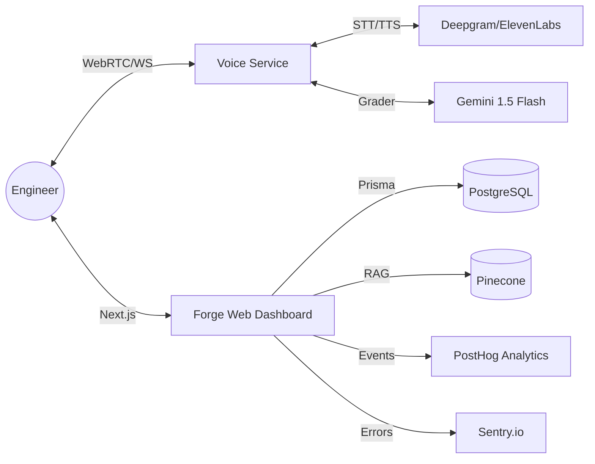

# 🎙️ InterviewForge AI: The Agentic Future of Engineering Talent

[](#)
[](#)
[](#)

> **"Silent practice is dead. The next generation of engineers speaks their code."**

InterviewForge AI is the world's first **Voice-First Agentic Interview Coach**. We have built a high-fidelity, real-time simulator that bridges the cognitive gap between "solving a problem" and "communicating a solution." By replicating the high-pressure environment of FAANG interview panels, InterviewForge transforms the $2.5B technical preparation market from passive consumption into active, vocal mastery.

---

## 🎯 The $100M Problem: The "Cognitive Collapse"

In the modern technical interview, 95% of software engineers fail not because of logic, but because of **Cognitive Friction**.
* **The Vocal Deficit**: Candidates spend 1,000+ hours on LeetCode in silence. In the real room, they are asked to simultaneously design a distributed lock *and* explain p99 latency trade-offs out loud. This results in verbal collapse.
* **The Feedback Vacuum**: Traditional mock interviews are inconsistent, unscalable, and prohibitively expensive ($200+/hr).
* **Memory Decay**: Without a longitudinal tracking system, candidates repeat the same architectural errors across every session.

---

## 🧠 The Solution: The Forge Engine

InterviewForge AI introduces a persistent, agentic technical coach that plays the role of a Principal Engineer (L7) from companies like Google, Meta, or Stripe.

### 1. Adaptive Real-time Calibration
Our engine doesn't just ask questions; it **calibrates**. Using the **Gemini 1.5 Flash** evaluation loop, the "Forge" reads your communication flow and technical depth in real-time, dynamically adjusting its next move:
* `FOLLOWUP`: Probes deeper into your specific architectural choices.
* `ADAPTIVE_DIFFICULTY`: Shifts from `medium` to `uber_hard` if you demonstrate rapid mastery.
* `PRESSURE_TEST`: Injects sudden constraints (e.g., "What if the network partition is permanent?") to test resilience.

### 2. RAG-Powered Contextual Intelligence
Leveraging a **Pinecone Vector Database**, the Forge retrieves questions and follow-ups based on:
* **The "Weak Spot" Tracker**: Automatically prioritizes topics where your historical average falls below 70%.
* **The Company Profile**: Tailors rubrics to the specific "cultural bar" of your target employer (e.g., Google's "Googliness" vs. Stripe's "Operating at all Levels").

---

## 🚀 Platform Capabilities

| Feature | Description | Impact |
| :--- | :--- | :--- |
| **Voice-First Loop** | High-fidelity TTS/STT via Deepgram & ElevenLabs | 100% immersive simulation |
| **Longitudinal Memory** | Persistent user profile stored in Prisma + Pinecone | 0% redundant practice |
| **7-D Rubric** | Scoring across Technical, Communication, Structure, and more | Deep-dive optimization |
| **Forge Digest** | Weekly AI-generated performance reports via Resend | Automated retention & growth |
| **Pro Analytics** | Real-time GitHub-style activity contribution map | Psychology of consistency |
| **Shareable Audits** | Encrypted public links for peer/mentor review | Social proof & feedback |

---

## 🏗️ World-Class Architecture

InterviewForge is built on a decoupled, high-performance micro-stack designed for sub-100ms latency in voice interactions.



### Technical Hardening
* **Security**: Built-in CSRF protection, HSTS, CSP, and Redis-backed rate limiting.
* **Resilience**: Account lockout mechanisms and graceful fallbacks for cloud service interruptions.
* **Observability**: Complete monitoring through Sentry and deep-event logging via PostHog.

---

## 💎 The ROI: Precision Engineering Preparation

| Metrics | Traditional Mock | InterviewForge AI |
| :--- | :--- | :--- |
| **Cost** | ~$225 / Session | **Unlimited** / $29.99 mo |
| **Availability** | Scheduled (24h lead) | **Instant** (0s lead) |
| **Feedback** | Subjective / Human | **Objective / Data-Driven** |
| **Consistency** | Low / Variable | **High / Mathematical** |

---

## 🛠️ Deploy the Future

### 1. Infrastructure Requirements
```bash
# Clone the repository
git clone https://github.com/harshmriduhash/interviewforge-ai.git

# Initialize the Postgres/Prisma layer
npx prisma db push && npx prisma db seed
```

### 2. Environment (The Production Keys)
Rename `.env.local` and inject your premium API keys for:
* **AI Runtime**: `GEMINI_API_KEY`, `DEEPGRAM_API_KEY`, `ELEVENLABS_VOICE_ID`
* **Intelligence Layer**: `PINECONE_API_KEY`, `PINECONE_INDEX`
* **Ops Layer**: `STRIPE_SECRET_KEY`, `RESEND_API_KEY`, `SENTRY_DSN`, `NEXT_PUBLIC_POSTHOG_KEY`

### 3. Execution
```bash
npm install
npm run build
npm run start
```

---

## 🗺️ Roadmap
- [x] **Phase 1**: Core Real-time Voice Architecture
- [x] **Phase 2**: Multi-modal Evaluation & RAG Integration
- [x] **Phase 3**: Enterprise Hardening & Retention Loops
- [ ] **Phase 4**: Multi-user "Mock-Room" Collaboration (Coming Q3)
- [ ] **Phase 5**: Native iOS/Android Agent Integration (Coming Q4)

---

&copy; 2026 InterviewForge AI. Built for those who build the future.