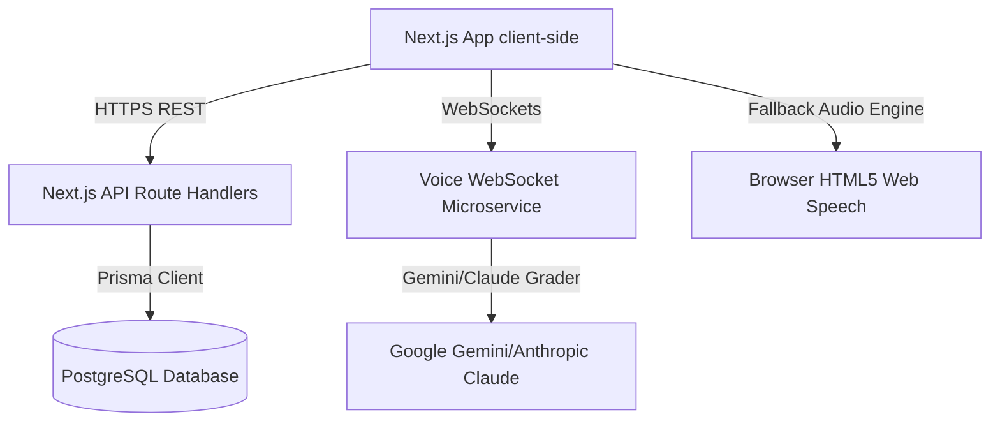

# 🎙️ InterviewForge AI

> **"Practice Until You Can't Fail."**  
> The premier, voice-first agentic technical interview coach designed to scale human preparation to FAANG expectations. Built for software engineers ready to master LeetCode, system design, and behavioral loops.

---

## 🚀 Executive Brief: The $100M SaaS Paradigm

InterviewForge AI is a high-yield, real-time vocal technical interview simulator. It replicates dynamic, high-pressure interview panels at Google, Meta, and Stripe, scoring performance across 7 critical dimensions, caching historical progress, and targeting weakness indicators dynamically.

---

## 🎯 Strategic Questions & Market Alignment

### 1. What Problem Does It Solve?
Every year, over 25 million software engineers job-hunt globally. Yet, **95% of first-time applicants fail dynamic technical loops**.
* **The "Spoken" Gap**: Candidates practice by silently typing solutions (LeetCode, Hackerrank), but real interviews are highly vocal, interactive, and verbal. Candidates collapse under the cognitive load of coding while explaining their thought process out loud.
* **The Access Gap**: High-fidelity mock interviews are either highly peer-dependent (leading to inconsistent quality and painful scheduling) or prohibitively expensive (human mock sessions cost upwards of $200–$250 per hour).
* **The Longitudinal Gap**: Feedback from human interviews is brief and generic (e.g. "Needs improvement in scalability"). There is no persistent system to record, audit, and systematically test past weaknesses.

### 2. How Does This Product Solve the Problem?
InterviewForge AI introduces a **voice-first technical agent** that plays the role of a seasoned L6/L7 Principal Architect:
* **Real-time Vocal Stimulation**: The AI coach speaks high-yield questions using high-fidelity natural voice synthesis, listens to spoken responses, transcribes user input on the fly, and asks dynamic technical follow-ups.
* **Adaptive Evaluation Rubrics**: Grade calculations recalculate dynamically after every verbal response across 7 specific engineering dimensions (Technical Accuracy, Communication Flow, System Structure, Depth & Rationale, Confidence, Filler Control, Pacing).
* **AI Annotation Report Sheets**: Captures full chronological transcripts, highlights exact strengths and optimizations, charts longitudinal growth calendars, and outlines targeted next action items.

### 3. Does It Save Time?
**Absolutely. It compresses preparation timelines by up to 60%.**
* **Instant Availability**: No scheduling, no timezone matching, no waiting. Candidates can initiate premium, interactive system design or algorithmic panels in under 5 seconds.
* **Granular Pinpointing**: Instead of wasting weeks doing generic, un-guided problem solving, our persistent **UserProgress RAG Memory** isolates specific design vulnerabilities (e.g. cache partition throttling) and schedules targeted recovery drills immediately.

### 4. Does It Save Money?
**Yes. It reduces mock preparation costs by 95%.**
* **Replaces Prohibitive Mock Panels**: Human panels on platforms like interviewing.io cost **$225 per session**. With InterviewForge, candidates get *unlimited* high-fidelity voice-first mocks for a flat subscription of **$29.99/month**.
* **Zero Infrastructure Startup Overhead**: Thanks to our unified **dual-mode audio pipeline**, local sandbox testing operates out-of-the-box using native browser Web Speech fallbacks—generating massive cost savings on STT/TTS cloud calls during testing.

---

## 🛠️ Software Architecture & System Design



### 1. High-Fidelity Decoupled Sub-Services
* **Core Web Server (Next.js 15+)**: Formulates NextAuth secure credentials, pages layouts, question banks, dashboards, and settings.
* **WebSocket Voice Engine (Node.js/Express/ws)**: Operates a real-time speech processor. Handles persistent audio chunk streams, manages connection state, and interfaces directly with cloud evaluators.
* **Database Pool (PostgreSQL & Prisma)**: Maintains core user profiles, longitudinal training states, and granular session exchange transcripts.

### 2. The Dual-Mode Pipeline Paradigm
To facilitate seamless off-the-shelf sandbox testing without complex API integrations, our real-time engine runs on a smart fallback mechanism:
1. **Cloud Mode**: Streamed voice data passes to Deepgram STT, synthesized questions speak back via ElevenLabs TTS, and evaluation triggers Claude/Gemini API calls.
2. **Browser Sandbox Mode**: Automatically falls back to HTML5 Web Speech APIs (`SpeechRecognition` & `SpeechSynthesis`) paired with dynamic mock rubric scorers. **Works 100% locally with zero API key configuration.**

---

## 🚀 Production Deployment Blueprint

Deploying InterviewForge AI for live production users requires deploying the Next.js frontend, the standalone voice WebSocket server, and a hosted database:

### Step 1: Deploy the PostgreSQL Database
* Create a managed database instance on **Supabase**, **Neon**, or **AWS RDS**.
* Enable high-speed query connection pools.
* Copy the connection string (e.g. `postgresql://...`).

### Step 2: Deploy the Next.js Web Client (Vercel)
1. Push the code to a private GitHub repository.
2. Import the project into **Vercel** (`interviewforge-ai-web` subdirectory).
3. Populate all variables listed in the **Production Environment Variables** section below.
4. Run the database seed in Vercel's build command:
   ```bash
   npx prisma db push && npx prisma db seed && next build
   ```

### Step 3: Deploy the Standalone Voice Microservice (Railway / Render)
1. Deploy the `voice-service` directory to a cloud provider with persistent WebSocket support (e.g. **Railway** or **Render**).
2. Configure Port `3003` (or bind to dynamic PORT env variable).
3. Set your production WebSocket URL (e.g. `wss://voice.interviewforge.ai`) as `NEXT_PUBLIC_VOICE_SERVICE_WS_URL` in your Next.js Vercel environment.

---

## 🔑 Production Environment Variables & Third-Party APIs

InterviewForge AI relies on highly specialized SaaS APIs to deliver a premium user experience. Rename `.env.example` to `.env` and configure the following parameters:

```env
# ==============================================================================
# 1. CORE NEXT.JS CONFIGURATION
# ==============================================================================
NODE_ENV="production"
NEXTAUTH_URL="https://interviewforge.ai"
NEXTAUTH_SECRET="[ADD_YOUR_32_CHAR_SECURE_JWT_SECRET_HERE]"

# ==============================================================================
# 2. PERSISTENT STORAGE
# ==============================================================================
DATABASE_URL="postgresql://[USER]:[PASSWORD]@[NEON_HOST]:5432/interviewforge?sslmode=require"

# ==============================================================================
# 3. ADVANCED VOICE AI PIPELINES (REAL-TIME OR OFFLINE PIPELINE ENGAGEMENTS)
# ==============================================================================
# WebSocket Endpoint for your voice-service microservice.
NEXT_PUBLIC_VOICE_SERVICE_WS_URL="wss://voice.interviewforge.ai"

# Deepgram Real-time Streaming Speech-To-Text (STT) API Key
# Register at: https://console.deepgram.com/
DEEPGRAM_API_KEY="[ADD_YOUR_DEEPGRAM_API_KEY_HERE]"

# ElevenLabs Custom Voice AI Text-To-Speech (TTS) API Key
# Register at: https://elevenlabs.io/
ELEVENLABS_API_KEY="[ADD_YOUR_ELEVENLABS_API_KEY_HERE]"
ELEVENLABS_VOICE_ID="21m00Tcm4TlvDq8ikWAM"

# ==============================================================================
# 4. LARGE LANGUAGE MODEL (LLM) GRADER ENGINES
# ==============================================================================
# Google Gemini API Key for dynamic scoring and follow-up generation
# Register at: https://aistudio.google.com/
GEMINI_API_KEY="[ADD_YOUR_GEMINI_API_KEY_HERE]"

# Anthropic Claude API Key (Optional alternative grader)
# Register at: https://console.anthropic.com/
ANTHROPIC_API_KEY="[ADD_YOUR_ANTHROPIC_API_KEY_HERE]"

# ==============================================================================
# 5. ENTERPRISE BILLING & METRICS SYSTEM
# ==============================================================================
# Stripe API secret keys. Used to synchronize mock checkouts to subscription tiers.
# Register at: https://dashboard.stripe.com/
STRIPE_SECRET_KEY="[ADD_YOUR_STRIPE_SECRET_KEY_HERE]"
STRIPE_WEBHOOK_SECRET="[ADD_YOUR_STRIPE_WEBHOOK_SECRET_HERE]"
STRIPE_PRO_PRICE_ID="[ADD_YOUR_STRIPE_PRO_PRICE_ID_HERE]"

# ==============================================================================
# 6. TRANSACTIONAL NOTIFICATIONS
# ==============================================================================
# Resend or SendGrid API configurations for transactional magic links & summaries.
# Register at: https://resend.com/
RESEND_API_KEY="[ADD_YOUR_RESEND_API_KEY_HERE]"
SYSTEM_SENDER_EMAIL="onboarding@interviewforge.ai"
```

---

## 🌟 Local Sandbox Verification Guide

### 1. Database & Migrations
```bash
cd interviewforge-ai-web
npm install
npx prisma db push
npx prisma db seed
```

### 2. Startup Commands
```bash
# Terminal 1: Launch Next.js Web Client (Port 3000)
cd interviewforge-ai-web
npm run dev

# Terminal 2: Launch Voice Microservice (Port 3003)
cd voice-service
npm install
npm start
```
Open **[http://localhost:3000](http://localhost:3000)** in your browser and log in with your seeded test account to calibrate your microphone and launch spoken panels.